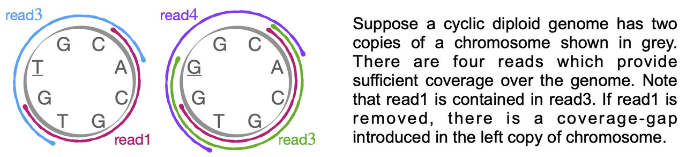

containX
========================================================================

containX is a prototype implementation of an algorithm that decides which contained reads can be dropped during overlap graph sparsfication. Reads which are substrings of longer reads are typically referred to as contained reads. The [string graph model](https://doi.org/10.1093/bioinformatics/bti1114) filters out contained reads during graph construction. Contained reads are typically considered redundant by commonly-used long-read assemblers. However, removing all contained reads can lead to coverage gaps, especially in diploid, polyploid genomes and metagenomes (see example below). Here we have implemented novel heuristics to distinguish redundant and non-redundant contained reads.

<p align="center">
 <br>
</p>

## Install

Clone source code from master branch.
  ```sh
  git clone https://github.com/at-cg/containX.git
  ```
To compile, the software requires C++ compiler with c++11 and openmp, which are available by default in GCC >= 4.8.
  ```sh
	cd containX
	make
  ```
Expect `containX` executable in your folder.

## Usage on diploid genomes

In the current algorithm, we assume that there are no sequencing errors (e.g., reads have been error-corrected). Future versions of code will permit a small error-rate. You will need a fastq file (say reads.fastq) to begin. Prior to using containX, use minimap2 [(Li 2018)](https://doi.org/10.1093/bioinformatics/bty191) to compute read overlaps. Also use hifiasm read overlapper [(Cheng et al. 2021)](https://doi.org/10.1038/s41592-020-01056-5) to identify reads that are sampled from a non-repetitive region of a genome and have a heterozygous SNP. Minimap2  can be downloaded from [here](https://github.com/lh3/minimap2/releases). A modified version of hifiasm code can be obtained from [here](https://github.com/cjain7/hifiasm/tree/hifiasm_dev_debug). Note that the modified code is available through branch *hifiasm_dev_debug*. Use the following commands to run the pipeline (may need to adjust thread count). 
```sh
minimap2 -t 32 -w 101 -k 27 -g 500 -B 8 -O 8,48 -E 4,2 -cx ava-ont reads.fastq reads.fastq > overlaps.paf
hifiasm  --dbg-het-cnt -o hifiasmoutput -t 32 reads.fastq
cat hifiasmoutput.het_cnt.log | tr -d ">" | awk '{if ($2 > 0) {print $1}}' > hifiasmoutput.readids.txt
containX -t 32 -p hifiasmoutput.readids.txt -n nonRedundantContainedReads.txt reads.fastq overlaps.paf
```

## Usage on haploid genomes

The same steps as above, but the step using hifiasm can be skipped. Users are welcome to run containX on simple examples provided in [data](data) folder.
```sh
minimap2 -t 32 -w 101 -k 27 -g 500 -B 8 -O 8,48 -E 4,2 -cx ava-ont reads.fastq reads.fastq > overlaps.paf
containX -t 32 -n nonRedundantContainedReads.txt reads.fastq overlaps.paf
```

## Preprint

- "[Coverage-preserving sparsification of overlap graphs for long-read assembly](https://doi.org/10.1101/2022.03.17.484715)". *BioRxiv*, 2022.
