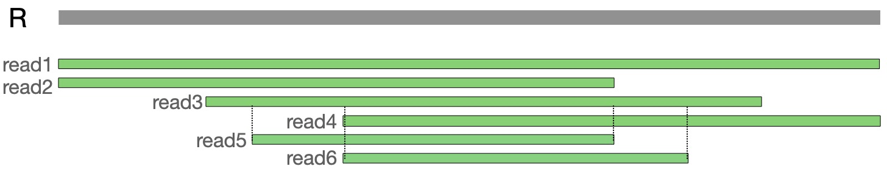

The above toy example has been generated using a random genome sequence R[1..5000] of length 5000. We have sampled six reads from R as following:

- `read1` = R[1..5000]
- `read2` = R[1..3000]
- `read3` = R[1000..4000]
- `read4` = R[2000..5000]
- `read5` = R[1500..3000]
- `read6` = reverse complement of R[2000:3500]

In the above set, `read1` has zero suffix-prefix overlaps, therefore it would be discarded during the initial graph cleanup. `read5` and `read6` are contained in `read3`. Both of these are redundant, so they will be removed by ContainX. The final graph will have six vertices associated with three reads. The suffix-prefix overlap link between `read2` to `read4` will be eliminated during transitive reduction.

  

