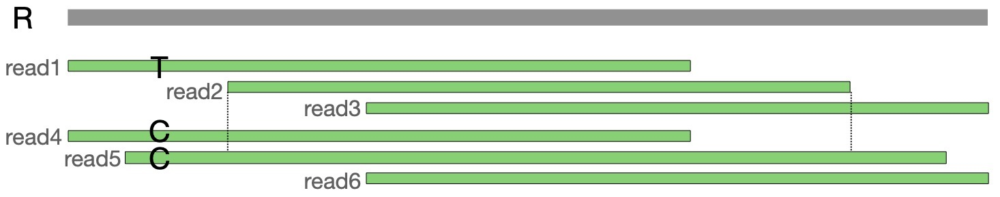

The reads in the above toy example have been generated using the same random sequence R[1..5000] of length 5000 as [example-1](../example-1). We also use sequence T which is identical to sequence R except the 500th character has been substituted from base T to base C. We have sampled six reads as following:

- `read1` = R[1..3000]
- `read2` = R[1000..4000]
- `read3` = R[2000..5000]
- `read4` = T[1..3000]
- `read5` = T[450..4500]
- `read6` = reverse complement of T[2000:5000]

In the above set, `read2` is contained in `read5`. Also, `read3` is just the reverse complement of `read6`. ContainX will mark `read3` as contained and redundant. However, `read2` will be retained by ContainX because if we remove it, we will not be able to spell sequence R in the assembly graph. `read1` has an exact suffix-prefix overlap with `read2` but not with `read5`. The final graph will have ten vertices associated with five reads.

  

